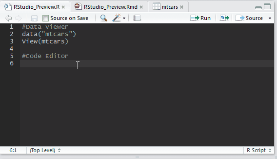

RStudio maybe the most common integrated development environment (IDE) used among R users. The easy to use but powerful interface enhance the efficieny and quality of writing R code. On May, the [RStudio team annouced the new version of RStudio (0.99)] which provides more features to make it even better.


###Data viewer (filtering, sorting and more)

In previous version of RStudio, using the `view()` function users can preview the data in a very nice grid table with at most previewing __1000__ rows of data. But if we only want to investigate part of it, we have to subset the data by code before running the data viewer. In this version, the data viewer not only can preview as much row as the data contains, but the current version can let users to directly interact with the data within the data viewer. It allows users click to filter, sort, and/or search within the data viewer without scripting.

This new functionality help much with data screening on the exploratory stage. The easy and intutative way can help user to understand better and quicker the data before further analysis. 

```{r eval=FALSE}
data("mtcars")
View(mtcars)
```


More on [Data viewer documentation]

---

## Code Editor



### Code Completion

In previous version, we must keep searching the R help guide or manual for the accurate naming of functions. Time is saved now by the new `code completion` features finally added into R studio. Like some of the other IDE, when user input the first few charaters of a default function/ user-defined variable names, even a function in a loaded library, a pop-up list will appear for choosing the desire command. (Apart from waiting, you can also invoke the completion list by pressing `Tab`.)

### Code Diagnostics

In the past, only after running the code and searching for a long time, we know there is a typo in the variable name or a missing bracket. But now, once again like other IDE, R studio can now diagnose our code right in the coding area without running the code. An icon will be appear in the left and the problem part will be underlined for easy checking. A day is saved now.

More on [Code Diagnostics documentation]

### Code snippets
Some code structures we used very often but they are developed from the same skeleton. Say, `if` and `apply`. To simplify and type less, RStudio now introduces a new feature names `code snippets`. For example, when you type `if` follow by a `Tab`, and select `{snippet}`, the skeleton of the `if` code will be automatically inserted. Users can also define their own snippet to shorten the typing work. Another day is saved. 

More on [Code Snippets documentation]


### Ace Editior
In this version of R studio, the source editor incorprates with [Ace Editior], a famous open-source IDE on web with a lot of features and hot-key faciliate code editing. 

#### Multiple cursors
As an useful features in Ace editior, RStudio now is also supported for multiple cursors selection. Keep hold the `Alt` key, the cursor will turn to a cross, and users can select multiple lines and amend all lines at the same time.

#### Vim mode enhanced
Previous version of RStudio includes Vim mode for faster text editing, but not many noticed that. With the inclusion of Ace Editor, the RStuido Vim mode are now upgraded to include more powerful features. 

More on [Vim mode improvements] and [Interactive Vim learning tutorial]

---

RStudio 0.99 still has much more features in this release. For example, if you are interested in __Link analysis__, [RStudio with Graphiz and DiagrammeR] can generate link graph now.

[Download RStudio 0.99] to give it a try or find out more on [RStudio v0.99 Preview Release Notes]. 

---

**Extend**

[R Blogger Preview Series](http://www.r-bloggers.com/?s=RStudio+v0.99+Preview)

---

[Download RStudio 0.99]:(https://www.rstudio.com/products/rstudio/download/)

[RStudio v0.99 Preview Release Notes]:(http://www.rstudio.com/products/rstudio/download/preview-release-notes/)

[RStudio team annouced the new version of RStudio (0.99)]:(http://blog.rstudio.org/2015/05/26/new-version-of-rstudio-v0-99/)


[Data viewer documentation]:(https://support.rstudio.com/hc/en-us/articles/205175388-Using-the-Data-Viewer)

[Code Diagnostics documentation]:(https://support.rstudio.com/hc/en-us/articles/205753617-Code-Diagnostics)

[Code Snippets documentation]:(https://support.rstudio.com/hc/en-us/articles/204463668-Code-Snippets)

[Vim mode improvements]:(http://blog.rstudio.org/2015/02/23/rstudio-0-99-preview-vim-mode-improvements/)

[RStudio with Graphiz and DiagrammeR]:(https://plus.google.com/+SharonMachlis/posts/CKLJTRHxe5K)

[Ace Editior]:(http://ace.c9.io/)

[Interactive Vim learning tutorial]:(http://www.openvim.com/sandbox.html)